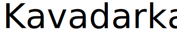

## Кавадарка Стартер

Супер репо за мрзливи програмери. Само клонирај го и терај.

## И шо е воа сеа?

Види сеа...

- Ти треба Node 16+
- Клонирај го проектот
  - Ако не знајш тоа да го праиш или те мрзе, може и зипче да симниш
- Влези у фолдерот
- Напрај `npm install`
- Избилдај го со `npm run билдајБаце`
- Воа ќе ти напрае еден фајл `bundle.js`, воа е твојот код преведен од кавадаречки у ЈаваСкрипт
- Изврши го со `node bundle.js`

Од туа натаму е твое, ти одлучуиш шо сакаш да кажиш и направиш - напрај некоа апликација на нашки на пример.

Отприлика воа е работта:

Кодот у `src/index.kk` е виа:

```
ај низа нека е []

низа.тури(1)
низа.тури(2)
низа.тури(3)

пиши(низа)

за (некој елемент у низа.напрајДаЕ(елемент => елемент * елемент)) {
  пиши(елемент)
}
```

Виа код ќе ти изваде нешто вакво ка ќе се компајлира у ЈаваСкрипт:

```js
'use strict';

var низа = [];
низа.push(1);
низа.push(2);
низа.push(3);
console.log(низа);
for (var _i = 0, _a = низа.map(function (елемент) { return елемент * елемент; }); _i < _a.length; _i++) {
    var елемент = _a[_i];
    console.log(елемент);
}
```

А ако го извршиш ќе вииш нешто вакво:

```ts
[ 1, 2, 3 ]
1
4
9
```
